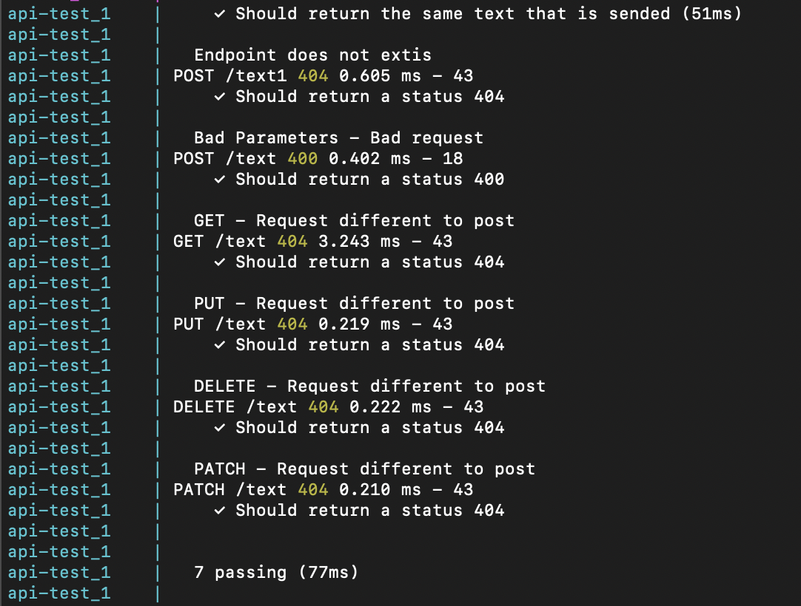
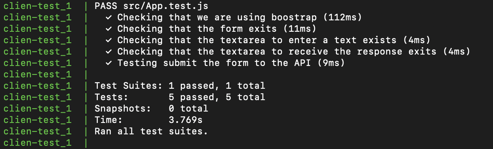
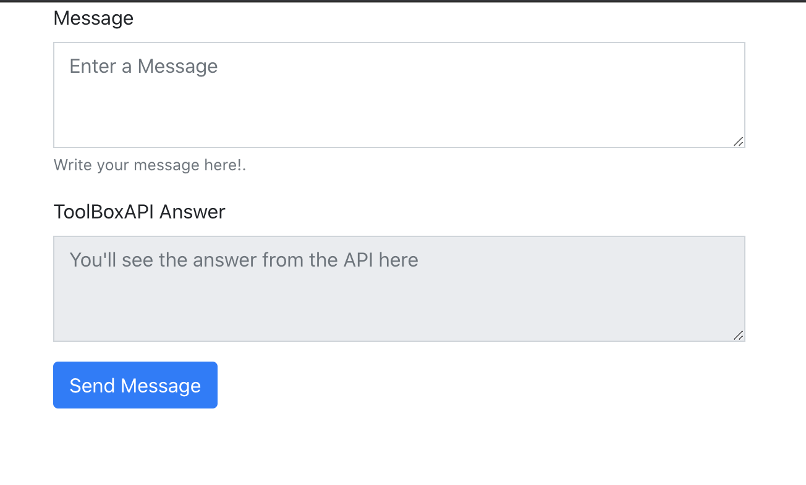

# EXPRESS API AND REACT API + Unit Testing + Docker
Frontend and backend integration using node js with express framework and React as a client. 
The API was created with node js 8 and unit testing with chai and supertest. 
The unit testing for React was done with jest. 

## Table of Contents
1. [Installation](#installation)
3. [API Endpoints Descriptions](#api-endpoints-descriptions)
4. [How to Interact with the app](#how-to-interact-with-the-app)

## Installation:
All the installation process and usability of this apps was created with docker version 19.03.12.
### How to build and run the app
1. Clone the repository
     ```
    git clone https://github.com/giovanib02/FullStack-ExpressAPIAndReactApp.git
    ```
2. Enter inside the main folder 
    ```
    cd FullStack-ExpressAPIAndReactApp
    ```
    This command will be install in your computer all the dependencies. 
3. Create the docker images
    ```
    docker-compose build
    ```
4. Start the docker container
    ```
     docker-compose up
    ```
5. The app will be runing on port 3000
    ```
    http://localhost:3000/
    ```
6. The API will be runing on port 5000
    ```
    localhost:5000/text
    ```
    The API just allow the endpoint /text in using POST method. 

### How to run the unit testing cases
The configuration to run the test cases are inside of a docker image. 
The way to run it is following the next steps:
1. Clone the repository
     ```
    git clone https://github.com/giovanib02/FullStack-ExpressAPIAndReactApp.git
    ```
2. Enter inside the main folder 
    ```
    cd FullStack-ExpressAPIAndReactApp
    ```
    This command will be install in your computer all the dependencies. 
3. Create the docker images
    ```
    docker-compose -f docker-compose-testing.yml build
    ```
4. Start the docker container
    ```
     docker-compose -f docker-compose-testing.yml up
    ```
5. After starting the container you will be able to see the result of the test cases:
    
    
    

6. To modify the test cases you have to modify the files
    * For API Testing ./toolboxAPI/test/api/sendmessage.test.js
    * For React APP ./toolboxapp/src/App.test.js
## API Endpoints Descriptions
The API just has enabled one endpoint
1. localhost:5000/text   
Method: POST

### Input
This enppoint receive an JSON with the value message 
    ```
    {"message": "this is the message"}
    ```

### Output
This output of this endpoint is a JSON with the same value sended
    ```
    {"message": "this is the message"}
    ```
    
For other kind of request you will receive the message:
   ```Welcome to Toolbox API - ENDPOINT NOT FOUND ```
   
   
## How to Interact with the app

1. Insert a text in the first TextArea.
2. Click the "Send Message" Button.
3. You will see the message sended replicated in the second TextArea. 
